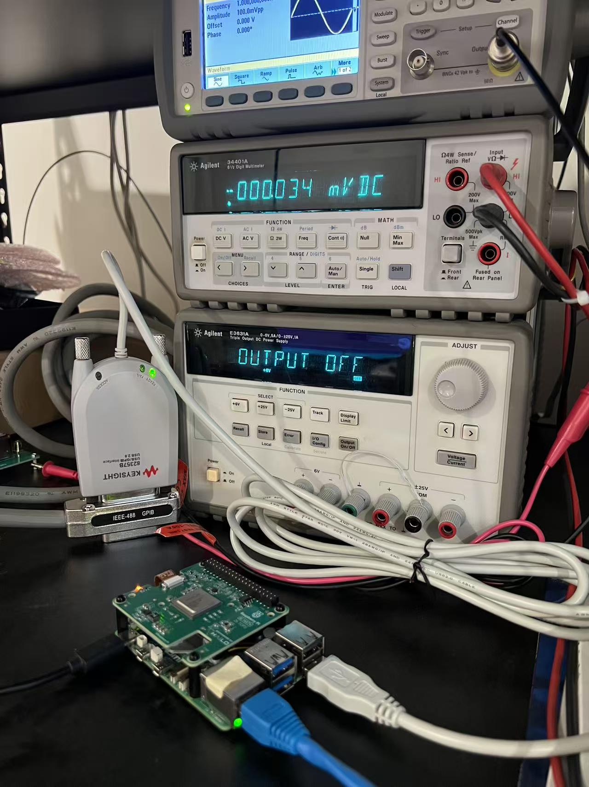

# Keysight 82357B on modern Linux with patched linux-gpib

This repo contains the files needed to use a **Keysight/Agilent 82357B USB-GPIB adapter** on modern Linux systems with a patched `linux-gpib` build.

It includes:

- an install script for dependencies, driver build, firmware, and udev setup
- two patch files for `linux-gpib`
- Python utilities for scanning the GPIB bus
- an optional Prologix-compatible GPIB-over-Ethernet server



## Status

This is intended for systems where stock `linux-gpib` packaging or older DKMS builds do not work reliably with newer kernels.

Tested on:
- Ubuntu 25.10
- Raspberry Pi 5
- aarch64
- kernel 6.17

Your exact distro/kernel may vary, but the repo is structured to make the setup reproducible.

## Quick install

Clone the repo and run:

```bash
sudo ./install.sh
```

To also install the TCP server:

```bash
sudo ./install.sh --with-server
```

The installer will:

1. install required packages
2. build `linux-gpib` from source
3. apply the patches in `patches/`
4. install Python bindings
5. fix `/etc/gpib.conf` for the 82357B
6. fetch and install stock firmware
7. install the required udev rule

## Verify the adapter

After install, plug in or replug the adapter, then run:

```bash
sudo modprobe agilent_82357a
sudo gpib_config --minor 0
sudo python3 tools/gpib_scan.py
```

Expected result:
- the adapter enumerates correctly
- the READY LED goes solid green
- connected instruments respond on the bus

## Optional GPIB-over-Ethernet server

This repo also includes a simple Prologix-compatible server:

- `server/gpib_server.py`
- `server/gpib_cold_init.py`
- systemd unit files in `server/`

If installed with `--with-server`, it listens on port `1234` by default.

Example test from another machine:

```bash
nc <host-ip> 1234
++ver
++addr 10
*IDN?
++read
```

To follow logs:

```bash
journalctl -u gpib-server -f
```

## Repo layout

- `install.sh` — main installer
- `patches/` — `linux-gpib` patches used by the installer
- `firmware/stock/` — stock firmware fetch helper and expected hash
- `udev/` — udev and modprobe config
- `tools/` — GPIB scan utilities
- `server/` — optional TCP bridge and systemd units
- `docs/assets/` — screenshots and images

## Notes

- Firmware is fetched separately by `firmware/stock/fetch.sh`.
- This repo does not bundle the original vendor firmware blob directly.
- The patch files in `patches/` are part of the documented working setup in this repository.

## License

See [LICENSE](LICENSE).
